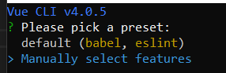
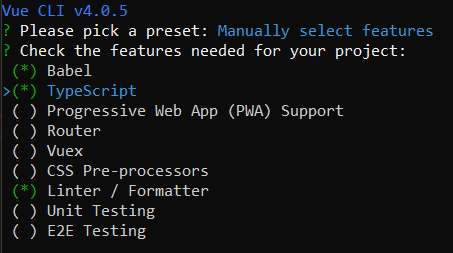

# Vue typscript with components
Simple use of typescript together with components

### Installation 
```
vue create project-name
```
then pick:





### main.ts
The equivalent of main.js; the entry file for the project.

### shims-tsx.d.ts
Allows the use of .tsx files. Read more about this here. https://www.typescriptlang.org/docs/handbook/jsx.html

### shims-vue.d.ts
Allows .vue single file components to be imported and used.

### Customize configuration
See [Configuration Reference](https://cli.vuejs.org/config/).
